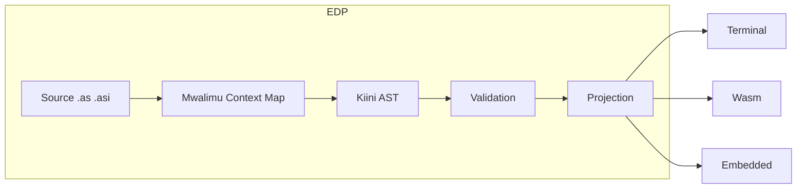

# 1. Philosophy and EDP

Previous: [Spec maintenance](00-maintenance.md) | [Overview](../SPECIFICATION.md) | Next: [Architecture and Files](02-architecture-and-files.md)

---

## Philosophy

**Asili** (Origin/Nature) connects high-level, Swahili-first expression with predictable, performant execution.

### Core pillars

| Pillar | Swahili | Meaning |
|--------|---------|---------|
| **Lugha-Mama** | Identity | Swahili is the logic; programming is in the user's primary conceptual language. |
| **Nguvu** | Performance | Zero-cost abstractions; Asili aims for C/Rust-class performance. |
| **Uwazi** | Transparency | No hidden behavior; allocations and system calls are explicit where it matters. |
| **Umoja** | Unity | One toolchain (**Pata**) for learning, applications, and embedded systems. |

---

## Environmental Diagnostic Protocol (EDP)

Types and tooling form the **Substrate** that ensures **Validation** before **Projection**.

1. **Foundation** — Source files (`.as`, `.asi`) and the `pata.toml` manifest.
2. **Friction** — The **Mwalimu** LSP provides a "Context Map" for error recovery and diagnostics.
3. **Synthesis** — The core (**Kiini**) transforms tokens into Asili Bytecode (`.asb`).
4. **Validation** — Strict-but-inferred type checking.
5. **Projection** — Deployment via the driver layer (Terminal, Wasm, Bare-Metal).

---

## Architectural philosophy

- **Multi-paradigm:** Functional (immutability, first-class functions), OOP (data + traits), Imperative (step-by-step).
- **Memory model:** Ownership and borrowing by default; managed/GC memory is provided only via opt-in modules. **`wazi`** (unsafe) blocks remain the escape hatch for manual memory and pointers.
- **Concurrency:** **`tenda`** — lightweight (green) threads.
- **Target environments:** Terminal (native), Browser (Wasm), Cloud (API), Embedded (bare metal).

Mwalimu (the LSP/compiler) must provide rich **Context Maps** for ownership and borrowing errors, showing where values are created, moved, borrowed, and dropped so that friction is resolved at the Foundation/Validation stages.

---

Previous: [Spec maintenance](00-maintenance.md) | [Overview](../SPECIFICATION.md) | Next: [Architecture and Files](02-architecture-and-files.md)
